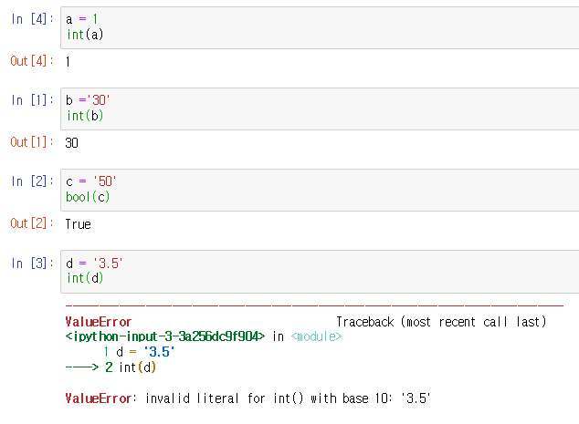

# Homework #

## 1번 문제 ##

> Python에서 사용할 수 없는 식별자(예약어)를 찾아 작성하세요.

```python
import keyword
print(keyword.kwlist)		# 이렇게 하면 키워드를 확인할 수 있다.
```

```
False, None, True, and, as, assert, break, class, continue, def, del, elif, else, except, finally, for, from, global, if, import, in, is, lambda, nonlocal, not, or, pass, raise, return, try, while, with, yield
```

* 파이썬에서 식별자는 변수, 함수, 모듈, 클래스 등을 식별하는데 사용되는 이름이므로 다른 이름으로 사용할 수 없다.


## 2번 문제 ##

> 파이썬에서 float 는 실수를 표현하는 과정에서 같은 값으로 일치되지 않습니다. (floating point rounding error)
> 따라서 아래의 값을 비교하기 위해 작성해야하는 코드를 작성하세요.
> a = 0.1 * 3
> b = 0.3

방법 1)

```python
import math
a = 0.1 * 3
b = 0.3
math.isclose(a, b)		#가장 간단한 방법
```

방법 2)

```python
a = 0.1 * 3
b = 0.3
abs(a - b) <= 1e-10
```

방법 3)

```python
import sys
a = 0.1 * 3
b = 0.3
abs(a - b) <= sys.float_info.epsilon
```


## 3번 문제 ##

> 이스케이프 문자열 중 1) 줄바꿈 2) 탭 3) \ 을 작성하세요.

1) 줄바꿈

```python
print('\n')

print('내용', end = '\n')
```

2) 탭

```python
print('\t')

print('내용', end = '\t')
```

3) \

```python
print('\\')

print('내용', end = '\\')
```


## 4번 문제

> "안녕 철수야" 를 String Interpolation 을 사용하여 출력하세요.

방법 1)		%-formatting

```python
name = '철수'
print('안녕 %s야' %name)
```

방법 2)		str.format()

```python
name = '철수'
print('안녕 %s야'.format(name))
```

방법 3)		f-string

```python
name = '철수'
print(f'안녕 {name}야')
```


## 5번 문제

> 다음 중 형변환시 오류가 발생하는 것은?
> str (1)	int ('30')	int (5)	bool('50')	<u>**int ('3.5')**</u>



* string 3.5를 int로 변환할 수는 없다.