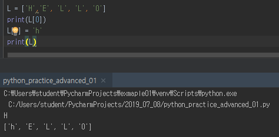

# Homework_day02


## 1번 문제

> 아래 보기 중, 변경할 수 있는(mutable) 것과 변경 불가능한 것(immutable)을
> 구분 하시오.
>
> **<u>String</u> 	List	 <u>Tuple</u>	 <u>Range</u>	 Set	 Dictionary**

=> String, Tuple, Range는 불변값이고 나머지는 변경 가능하다

1) string 값 변경 시도 : 불가


2) list 값 변경 시도 : 가능



3) tuple 값 변경 시도 : 불가


4) range 값 변경 시도 : 불가


5) set 값 변경 시도 : 다음과 같은 연산자로 변경 가능


6) dictionary 값 변경 시도 : 가능 - key값으로 접근하여 변경가능


--------------------------------------------------------------------------------


## 2번 문제

> range와 slicing을 활용하여 1부터 50까지 숫자 중 홀수로 이루어진
> 리스트를 만드시오.

1) range & slicing 사용

```python
R = range(1, 51)
L = list(R)
L = L[0:-1:2]
print(L)
```

(2 - 1 실행화면)


2) range 사용

```python
odd_num_list = []
for i in range(1, 51):
    if i % 2 == 1:
        odd_num_list.append(i)
print(odd_num_list)
```

(2 - 2 실행화면)


--------------------------------------------------------


## 3번 문제

> 반 학생들의 정보를 이용하여 key는 이름, value는 나이인 딕셔너리를 만드시오.

```python
name_list = []
name_dict = {}
for i in range(24):
    x = input()
    name_list.append(x)

#print(name_list)

for i in range(24):
    name_dict[name_list[i]] = 26

print(name_dict)
```

(아래 3번 문제 실행화면) - 학생 이름은 구글 폼에서 복사해왔습니다.


