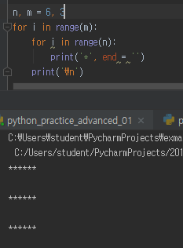
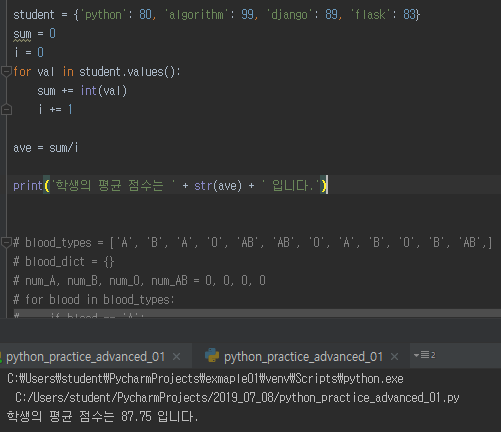
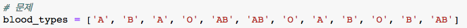
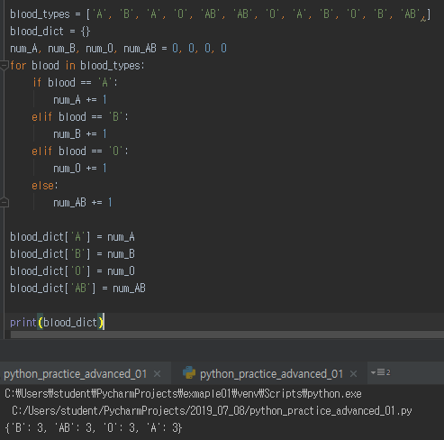

# Workshop_day02


## 1번 문제

> 두 개의 정수 n과 m이 주어질 때, 반복문을 사용하여 별(*) 문자를 이용해
> 가로의 길이가 n, 세로의 길이가 m인 사각형을 출력하시오.

```python
n, m = 6, 10
for i in range(m):
    for i in range(n):
        print('*', end = '')
    print('\n')
```

(아래 1번 문제 실행화면)




-------------------------------------------------------------


## 2번 문제

> 과목명과 점수가 담긴 딕셔너리가 있을 때, 평균 점수를 출력하시오.

```python
student = {'python': 80, 'algorithm': 99, 'django': 89, 'flask': 83}
sum = 0
i = 0
for val in student.values():
    sum += int(val)
    i += 1

ave = sum/i

print(ave)
```

(아래 2번 실행화면)




-------------------------------------------------


## 3번 문제

> 다음은 여러 사람의 혈액형(A, B, AB, O)에 대한 데이터이다. 반복문을 사용하여 key는 혈액형의 종류, value는 인원 수인 딕셔너리를 만들고 출력하시오.
>
> 

```python
blood_types = ['A', 'B', 'A', 'O', 'AB', 'AB', 'O', 'A', 'B', 'O', 'B', 'AB',]
blood_dict = {}
num_A, num_B, num_O, num_AB = 0, 0, 0, 0
for blood in blood_types:
    if blood == 'A':
        num_A += 1
    elif blood == 'B':
        num_B += 1
    elif blood == 'O':
        num_O += 1
    else:
        num_AB += 1

blood_dict['A'] = num_A
blood_dict['B'] = num_B
blood_dict['O'] = num_O
blood_dict['AB'] = num_AB
```

(아래 3번 문제 실행화면)



