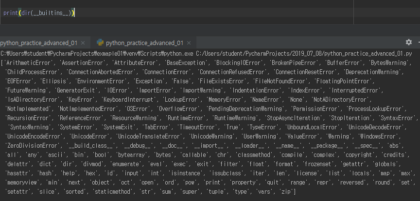
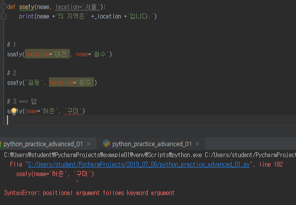
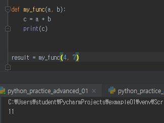

# Homework_day03


## 1번 문제

> Python에서 기본으로 사용할 수 있는 Built in function 5개를 찾아서 작성하세요.

**float, list, set, bool, input**

```python
print(dir(__builtins__))	#이렇게 하면 내장함수를 확인할 수 있다.
```




-----------------------------------------------------------------------------------------------------------


## 2번 문제

> 다음과 같이 함수가 정의되어 있다. 보기 중, 오류가 발생하는 코드를 고르시오.

```python
def ssafy(name, lacation = '서울'):
    print(f'{name}의 지역은 {location}입니다.')
    
# 1
ssafy(location = '대전', name = '철수')

# 2
ssafy('길동', location = '광주')

# 3 ==> 답
ssafy(name = '허준', '구미')
```

keyword argument 는 제일 끝에 와야한다.

(2번 문제 실행화면)




------


## 3번 문제

> 다음과 같이 코드가 작성되어 있을 때, 변수 result에 저장된 값을 작성하시오.

**답 11 아님 --> None 이 담긴다. print문때문에 콘솔에 11이출력되기는하지만 반환된값이 없다**

```python
def my_func(a,b):
    c = a + b
    print(c)
    
result = my_func(4,7)
```

(3번 문제 실행화면)




