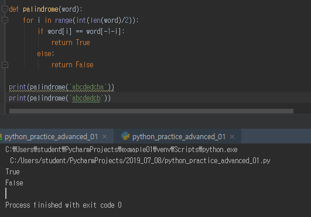

# Workshop_day03


## 1번 문제

> 단어를 입력받아 Palindrome을 검증하고 True나 False를 리턴하는 함수 palindrome(word)를 만들어보세요.

```python
def palindrome(word):
    for i in range(int(len(word)/2)):
        if word[i] == word[-1-i]:
            return True
        else:
            return False

print(palindrome('abcdedcba'))
print(palindrome('abcdedcb'))
```

(1번 문제 실행화면)



------------------------------------------------------------------------------------------------------------

