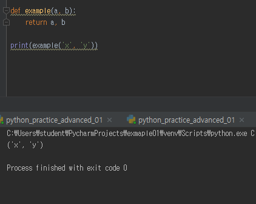

# Homework_day04

## 1번 문제

> Python에서 변수를 찾을 때 접근하는 이름 공간을 순서대로 작성하시오.

**Local / Enclosed / Global / Builtin**  scope

------------------------------------------

## 2번 문제

> 다음 중 옳지 않은 것을 고르시오.
> **(1) 함수는 오직 하나의 객체만 반환할 수 있어서, ‘return a, b’처럼 쓸 수 <u>없다.</u>**
> (2) 함수에서 return을 작성하지 않으면 None 값을 반환한다.
> (3) 함수의 인자(parameter)는 함수를 선언할 때 설정한 값이며,
> 인수(argument)는 함수를 호출할 때 넘겨주는 값이다.
> (4) 가변 인자를 설정할 때는 인자 앞에 *을 붙이고, 이 때는 함수 내에서 tuple로 처리된다.

답 : 1번  - return a, b 처럼 쓸 수 있다

(2번 문제 - (1)번보기 실행화면)	:	리턴값이 두개여도 오류가 나지 않음

------

## 3번 문제

> 재귀 함수를 쓰는 장점과 단점을 작성하시오.

**장점**

1) 변수사용을 줄일 수 있다.

2) 코드가 간결하고 직관적인 경우가 있다

**단점**

1) 결과가 나오기까지 더 오래걸린다. (for문이 더 빠름)

2) python 내에서 1000번이상 함수가 호출되는 경우 자동으로 멈춘다.