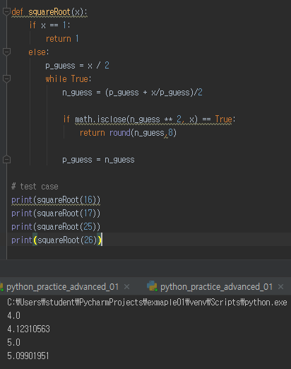

# Workshop_day04


## 1번 문제

> 양의 정수 x를 입력 받아 제곱근의 근사값을 반환하는 함수를 작성하세요. (sqrt() 사용 금지)

```python
import math

def squareRoot(x):
    if x == 1:
        return 1
    else:
        p_guess = x / 2
        while True:
            n_guess = (p_guess + x/p_guess)/2

            if math.isclose(n_guess ** 2, x) == True:
                return round(n_guess,8)

            p_guess = n_guess

# test case
print(squareRoot(16))
print(squareRoot(17))
print(squareRoot(25))
print(squareRoot(26))
    
```

(1번 문제 실행화면)



