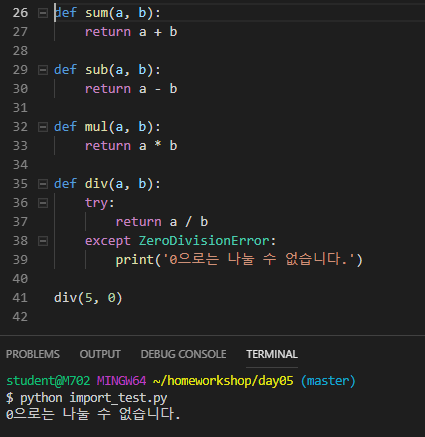

# Workshop_day05


## 1번 문제

> 2개의 숫자를 인자로 받아 더하기, 빼기, 곱하기, 나누기 연산의 결과를 반환하는 4개의
> 함수를 calc.py에 작성하시오. 단, 나누기 연산에서는 try except 구문을 사용하여
> ‘0’으로 나누려고 하는 경우에는 문자열 ’0으로는 나눌 수 없습니다.’을 반환하시오.

```python
def sum(a, b):
    return a + b

def sub(a, b):
    return a - b

def mul(a, b):
    return a * b

def div(a, b):
    try:
        return a / b
    except ZeroDivisionError:
        print('0으로는 나눌 수 없습니다.')

div(5, 0)
```


---------------------------------------------------------------------


## 2번 문제

> 1번에서 작성한 calc.py 모듈을 import하여, 각 연산을 수행하는 함수들을 실행하는
> 코드를 작성하시오.

```python
import calc

print(calc.sum(1, 2))
print(calc.sub(2, 1))
print(calc.mul(1, 2))
print(calc.div(2, 1))

```

(2번 문제 실행화면)



