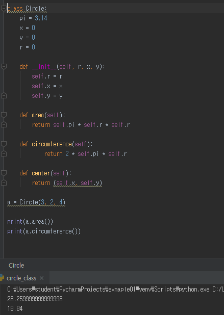

# Workshop_day06


## 1번 문제

> 아래와 같은 클래스 Circle이 있을 때, 반지름이 3이고 x, y 좌표가 (2, 4)인 원을 만들어
> 넓이와 둘레를 출력하시오.

```python
class Circle:
    pi = 3.14
    x = 0
    y = 0
    r = 0
    
    def __init__(self, r, x, y):
        self.r = r
        self.x = x
        self.y = y
        
    def area(self):
        return self.pi * self.r * self.r
   
	def circumference(self):
        return 2 * self.pi * self.r
    
    def center(self):
        return (self.x, self.y)
    
```

(1번 문제 실행화면)



